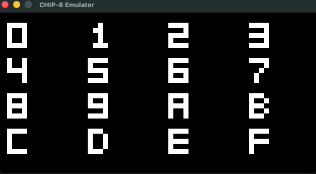
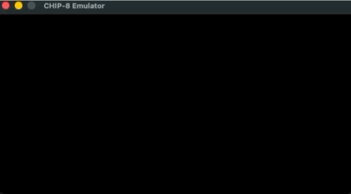
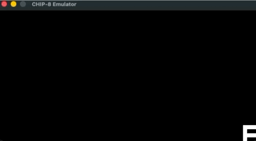

## CHIP-8 Emulator 

[CHIP-8](https://en.wikipedia.org/wiki/CHIP-8) is a virtual processor designed in the 1970s to provide a simple and portable environment for game development across platforms. The CHIP-8 is not a physical piece of hardware, rather a virtual interpreter that can read a binary file encoded with instructions.

This is my implementation of the legendary processor, written in C++

---

## Table of Contents

- [Architecture Overview](#architecture-overview)
- [Features](#features)
- [Demos](#demos)
- [Usage](#usage)
- [Keypad](#keypad)
- [Binary ROMs and Testing](#binary-roms-and-testing)
- [File Structure](#file-structure)
- [Motivation](#motivation)
- [Acknowledgements](#acknowledgements)

---

## Architecture Overview

The CHIP-8 system consists of
- An instruction set of 35 2-byte instructions
- 16 8-bit general purpose registers
- A 16-bit index register used to hold memory addresses 
- A 16-bit Program Counter
- An 8-bit delay timer, decremented at 60Hz
- An 8-bit sound timer, decremented at 60Hz
- A 64x32 monochrome display
- A virtual keyboard
- An entire 4 KB of memory! (4096 bytes 🔥) 

The CPU executes instructions at a fixed rate, while the display independently refreshes at 1000 FPS

---

## Features

- Full implementation of the standard CHIP-8 instruction set  
- Accurate instruction fetch–decode–execute cycle  
- SDL2-based display and keyboard input  
- Platform abstraction layer separating CPU logic from OS concerns  
- Deterministic test ROMs for validating individual instructions  
- Demo ROMs showcasing graphics, input, and wrapping behavior   

---

## Demos 

### Font Set Demo



### Keypad Input Demo



### Screen Wrapping Demo



---

## Usage

To generate the binary, run `python3 <script_name>`. 
- Example: `python3 roms/scripts/alu.py`

To compile the emulator
- `make emulate`

To run the emulator: `./emulate <path to ROM binary>`
- Example: `./emulate roms/binaries/demos/art_demo.ch8`

As a platform layer between the CHIP-8 CPU and the OS, the program uses the SDL2 library. The rules to compile the Makefile assume the SDL2 library is located in `/opt/homebrew`. The emulator was developed and tested on macOS.

---

### Keypad

The emulator implements a virtual CHIP-8 keyboard that is mapped to a standard QWERTY Keyboard

```text
CHIP-8 Keypad              QWERTY Keyboard
┌───┬───┬───┬───┐        ┌───┬───┬───┬───┐
│ 1 │ 2 │ 3 │ C │        │ 1 │ 2 │ 3 │ 4 │
├───┼───┼───┼───┤        ├───┼───┼───┼───┤
│ 4 │ 5 │ 6 │ D │  --->  │ Q │ W │ E │ R │
├───┼───┼───┼───┤        ├───┼───┼───┼───┤
│ 7 │ 8 │ 9 │ E │        │ A │ S │ D │ F │
├───┼───┼───┼───┤        ├───┼───┼───┼───┤
│ A │ 0 │ B │ F │        │ Z │ X │ C │ V │
└───┴───┴───┴───┘        └───┴───┴───┴───┘
```

---

## Binary ROMs and Testing

For testing, I have created a collection of CHIP-8 ROMs located inside of `roms/binaries`. These are binary files generated by different python scripts inside of `roms/scripts` (many created with the help of my friend Gemini 😁). 

Majority of these ROMs act as unit tests for specific operations the CPU does. This is how my emulator has ensured its correctness.

There are a collection of roms located inside `roms/binaries/demos` which are more interesting 
- `art_demo.ch8` draws random characters to the screen continuously 
- `font_set.ch8` displays all the built in font characters
- `keypad_demo.ch8` displays the current key that was most recently pressed
- `screen_wrap_demo.ch8` animates a moving 'F' across the screen, wrapping around the borders

---

## File Structure

```text
src/
├── chip8/
│   ├── cpu.cpp
│   ├── cpu.hpp
│   ├── memory.cpp
│   ├── memory.hpp
│   ├── timers.cpp
│   ├── timers.hpp
│   ├── display.cpp
│   ├── display.hpp
│   ├── keypad.cpp
│   ├── keypad.hpp
│   ├── constants.hpp
│   ├── chip8.cpp
│   └── chip8.hpp
├── platform/
│   ├── platform.cpp
│   └── platform.hpp
├── main.cpp
roms/
├── binaries/
│   ├── demos/
│   │   ├── font_set.ch8
│   │   ├── keypad_demo.ch8
│   │   ├── art_demo.ch8 
│   │   └── screen_wrap_demo.ch8
│   └── tests/
├── scripts/
│
assets/
├── font.png
├── keypad.gif
└── wrap.gif
Makefile
README.md
```

---

## Motivation 

I built this project to deepen my understanding of computer architecture and to strengthen the skills required for my work as a Computer Architecture researcher at UCSB. As Richard Feynman famously said, *"What I cannot create, I do not understand."* 

CHIP-8 provided an ideal platform for exploring instruction decoding, timing models, memory systems, and platform abstraction in a contained and approachable environment. By building the emulator from the ground up, I gained practical experience translating architectural specifications into a working system.

Beyond architecture, this project significantly improved my systems programming skills in C++, as well as my debugging discipline and attention to detail, preparing me to develop reliable low-level software.

> *By wisdom a house is built, and through understanding it is established.* \- Proverbs 24:3

---

## Acknowledgements

As a conceptual reference for the CHIP-8 architecture and instruction semantics, the following resource was consulted: 
- [Guide to Making a CHIP-8 Emulator](https://tobiasvl.github.io/blog/write-a-chip-8-emulator/) by Tobias Langhoff

Some custom test ROMs used for validation were developed with the assistance of Gemini 

